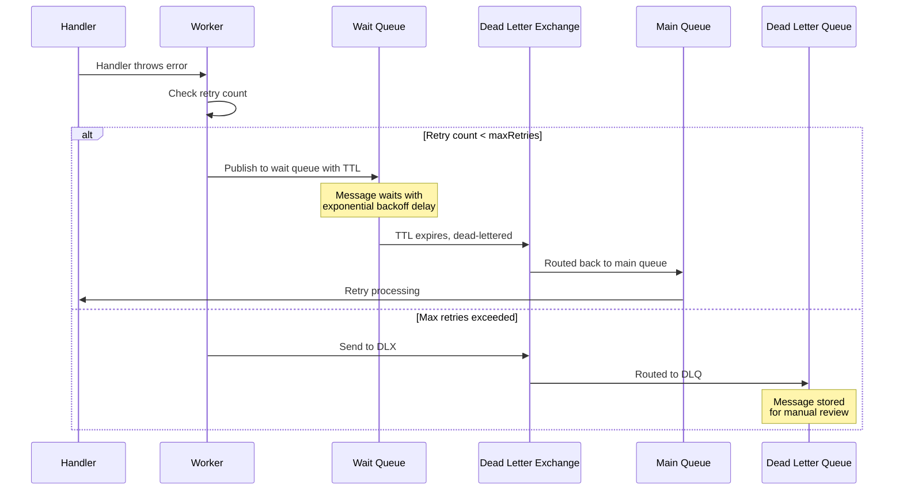

# Resilient Message Handling with Automatic Retry Strategy

Building reliable message-driven applications means dealing with the inevitable: failures happen. Network timeouts, rate limits, temporary service outages — these transient issues shouldn't cause permanent message loss. Today, we're excited to announce a powerful new feature in **amqp-contract**: automatic retry with exponential backoff.

## The Challenge of Message Failure

In any distributed system using message queues, you'll encounter various types of failures:

```typescript
// ❌ Without proper retry handling (using deprecated unsafe handler pattern)
const worker = (
  await TypedAmqpWorker.create({
    contract,
    handlers: {
      processOrder: ({ payload }) => {
        // What happens when the payment service is temporarily down?
        return ResultAsync.fromPromise(
          paymentService.charge(payload),
          (error) => new RetryableError("Payment failed", error),
        ).map(() => undefined);
        // Without retry configuration, message may be lost or stuck
      },
    },
    urls: ["amqp://localhost"],
  })
)._unsafeUnwrap();
```

Common problems with naive retry approaches:

1. **Tight retry loops** - Failed messages are immediately reprocessed, overwhelming already-stressed services
2. **No backoff** - No time given for services to recover
3. **Infinite retries** - Messages stuck forever without reaching a dead letter queue
4. **Thundering herd** - All retried messages hit the system simultaneously
5. **Lost context** - No tracking of how many times a message has been retried

## Enter Automatic Retry with Exponential Backoff

amqp-contract now provides a built-in retry mechanism that solves all these problems using RabbitMQ's native TTL (Time To Live) and Dead Letter Exchange (DLX) pattern. Retry is configured at the **queue level** in the contract, making it declarative and automatic.

### Queue-Level Configuration

Configure retry options when defining your queue:

```typescript
import {
  defineQueue,
  defineExchange,
  defineContract,
  defineConsumer,
  defineMessage,
} from "@amqp-contract/contract";
import { TypedAmqpWorker, RetryableError } from "@amqp-contract/worker";
import { okAsync, ResultAsync } from "neverthrow";
import { z } from "zod";

const dlx = defineExchange("orders-dlx");
const orderMessage = defineMessage(z.object({ orderId: z.string(), amount: z.number() }));

// Define queue with retry configuration
const ordersQueue = defineQueue("orders", {
  deadLetter: { exchange: dlx },
  retry: {
    mode: "ttl-backoff",
    maxRetries: 3, // Maximum retry attempts (default: 3)
    initialDelayMs: 1000, // Start with 1 second delay (default: 1000)
    maxDelayMs: 30000, // Cap at 30 seconds (default: 30000)
    backoffMultiplier: 2, // Double the delay each time (default: 2)
    jitter: true, // Add randomness to prevent thundering herd (default: true)
  },
});

// defineContract auto-extracts exchanges, queues, and creates wait queue + retry bindings
const contract = defineContract({
  consumers: {
    processOrder: defineConsumer(ordersQueue, orderMessage),
  },
});

// Worker automatically uses queue's retry configuration
const worker = (
  await TypedAmqpWorker.create({
    contract,
    handlers: {
      processOrder: ({ payload }) =>
        // If this fails, message is automatically retried with exponential backoff
        ResultAsync.fromPromise(
          paymentService.charge(payload),
          (error) => new RetryableError("Payment failed", error),
        ).map(() => undefined),
    },
    urls: ["amqp://localhost"],
  })
)._unsafeUnwrap();
```

## Choosing a Retry Strategy

amqp-contract provides two retry modes to handle different requirements, both configured at the queue level:

### Immediate-Requeue Mode (Recommended)

A simpler mode that requeues failed messages immediately (no wait queues):

```typescript
import { defineQueue, defineExchange, defineContract } from "@amqp-contract/contract";
import { TypedAmqpWorker, RetryableError } from "@amqp-contract/worker";
import { okAsync, ResultAsync } from "neverthrow";

// Define queue with immediate-requeue retry
const ordersQueue = defineQueue("orders", {
  type: "quorum",
  deadLetter: {
    exchange: dlxExchange,
    routingKey: "orders.failed",
  },
  retry: { mode: "immediate-requeue", maxRetries: 3 }, // Dead-letter after 3 retry attempts
});

// Worker automatically uses queue's retry configuration
const worker = (
  await TypedAmqpWorker.create({
    contract,
    handlers: {
      processOrder: ({ payload }) =>
        ResultAsync.fromPromise(
          paymentService.charge(payload),
          (error) => new RetryableError("Payment failed", error),
        ).map(() => undefined),
    },
    urls: ["amqp://localhost"],
  })
)._unsafeUnwrap();
```

**How it works:**

- For quorum queues, messages are requeued with `nack(requeue=true)`, and the worker tracks delivery count via the native RabbitMQ `x-delivery-count` header.
- For classic queues, messages are re-published on the same queue, and the worker tracks delivery count via a custom `x-retry-count` header.
- When count exceeds `maxRetries`, the message is automatically dead-lettered (if DLX is configured) or dropped.
- No wait queues or TTL management needed.

**Best for:**

- Simpler architecture requirements
- When immediate retries are acceptable
- Avoiding head-of-queue blocking issues

**Trade-off:** No exponential backoff — retries are immediate.

### TTL-Backoff Mode

This mode uses TTL (Time To Live) + wait queue pattern for **exponential backoff**. Wait queues and bindings are **automatically generated** by `defineContract`:

```typescript
const ordersQueue = defineQueue("orders", {
  deadLetter: { exchange: dlx },
  retry: {
    mode: "ttl-backoff",
    maxRetries: 3,
    initialDelayMs: 1000,
    maxDelayMs: 30000,
    backoffMultiplier: 2,
    jitter: true,
  },
});
```

**Best for:**

- When you need configurable delays between retries
- Preventing thundering herd problems
- Giving downstream services time to recover

**Trade-off:** More complex architecture with wait queues (auto-created), and potential head-of-queue blocking with mixed TTLs.

| Feature                | TTL-Backoff                      | Immediate-Requeue |
| ---------------------- | -------------------------------- | ----------------- |
| Retry delays           | Configurable exponential backoff | Immediate         |
| Architecture           | Wait queues + Headers exchanges  | No wait queues    |
| Head-of-queue blocking | Possible with mixed TTLs         | None              |

### How TTL-Backoff Works Under the Hood

When a handler throws an error with retry configured, the following sequence occurs:



**Key advantages of this approach:**

1. **Non-blocking** - Messages wait in a separate queue, not blocking the consumer
2. **Native RabbitMQ features** - Uses TTL and wait queues, no external dependencies needed
3. **Durable** - Wait queues are as durable as their main queue
4. **Scalable** - Works across multiple worker instances

### Exponential Backoff in Action

With default settings, retry delays increase exponentially:

| Attempt | Delay   | Total Wait |
| ------- | ------- | ---------- |
| 1       | 1,000ms | 1s         |
| 2       | 2,000ms | 3s         |
| 3       | 4,000ms | 7s         |
| 4 (DLQ) | -       | -          |

With jitter enabled (default), actual delays vary between 50-100% of the calculated value, preventing all retried messages from hitting downstream services simultaneously.

## Setting Up Dead Letter Exchange

A Dead Letter Exchange (DLX) can be configured at the queue level, to which failed messages will be sent (after all retry attempts, if any configured) instead of being dropped:

```typescript
import {
  defineContract,
  defineExchange,
  defineQueue,
  definePublisher,
  defineConsumer,
  defineMessage,
} from "@amqp-contract/contract";
import { z } from "zod";

// Define the main exchange
const mainExchange = defineExchange("orders");

// Define the Dead Letter Exchange
const dlxExchange = defineExchange("orders-dlx");

// Define your main queue with deadLetter configuration
const ordersQueue = defineQueue("orders", {
  deadLetter: {
    exchange: dlxExchange,
    routingKey: "orders.failed",
  },
});

// Define message schema
const orderMessage = defineMessage(
  z.object({
    orderId: z.string(),
    customerId: z.string(),
    amount: z.number().positive(),
  }),
);

// Compose the contract - exchanges, queues, bindings auto-extracted
const contract = defineContract({
  consumers: {
    processOrder: defineConsumer(ordersQueue, orderMessage),
  },
  publishers: {
    orderCreated: definePublisher(mainExchange, orderMessage, { routingKey: "order.created" }),
  },
});
```

## Explicit Error Classification

Not all errors should be retried. amqp-contract provides two error classes for explicit control:

### RetryableError - For Transient Failures

Use `RetryableError` when the operation might succeed if retried:

```typescript
import { TypedAmqpWorker, RetryableError } from "@amqp-contract/worker";
import { okAsync, ResultAsync } from "neverthrow";

// Retry is configured at the queue level in the contract
const worker = (
  await TypedAmqpWorker.create({
    contract,
    handlers: {
      processOrder: ({ payload }) =>
        ResultAsync.fromPromise(
          externalApiCall(payload),
          (error) =>
            // Explicitly signal this should be retried
            new RetryableError("External API temporarily unavailable", error),
        ).map(() => undefined),
    },
    urls: ["amqp://localhost"],
  })
)._unsafeUnwrap();
```

### NonRetryableError - For Permanent Failures

Use `NonRetryableError` when retrying would be pointless:

```typescript
import { TypedAmqpWorker, NonRetryableError, RetryableError } from "@amqp-contract/worker";
import { okAsync, ResultAsync, Result } from "neverthrow";

// Retry is configured at the queue level in the contract
const worker = (
  await TypedAmqpWorker.create({
    contract,
    handlers: {
      processOrder: ({ payload }) => {
        // Validation errors should not be retried
        if (payload.amount <= 0) {
          return ResultAsync.value(
            err(new NonRetryableError("Invalid order amount - cannot be negative")),
          );
        }

        // Business rule violations - check and fail fast
        return ResultAsync.fromPromise(isBlacklistedCustomer(payload.customerId))
          .andThen((isBlacklisted) => {
            if (isBlacklisted) {
              return errAsync(new NonRetryableError("Customer is blacklisted"));
            }
            return ResultAsync.fromPromise(
              processPayment(payload),
              (error) => new RetryableError("Payment failed", error),
            ).map(() => undefined);
          })
          .mapErr((error) => new RetryableError("Check failed", error));
      },
    },
    urls: ["amqp://localhost"],
  })
)._unsafeUnwrap();
```

**NonRetryableError behavior:**

- Message is immediately sent to DLQ (if configured)
- No retry attempts are made
- Perfect for validation errors, business rule violations, or permanent external failures

### Error Type Decision Guide

| Error Type          | Use Case                                            | Behavior                                   |
| ------------------- | --------------------------------------------------- | ------------------------------------------ |
| `RetryableError`    | Transient failures (network, rate limits, timeouts) | Retry based on queue's retry configuration |
| `NonRetryableError` | Permanent failures (validation, business rules)     | Send to DLQ (if configured) or drop        |
| Any other error     | Unexpected failures                                 | Retry based on queue's retry configuration |

## Safe Handlers for Maximum Control

For the most explicit error handling, use safe handlers that return `ResultAsync<Result>`:

```typescript
import { defineHandler, RetryableError, NonRetryableError } from "@amqp-contract/worker";
import { okAsync, ResultAsync, Result } from "neverthrow";
import { match } from "ts-pattern";

const processOrderHandler = defineHandler(contract, "processOrder", ({ payload }) => {
  // Validation - non-retryable
  if (payload.amount <= 0) {
    return errAsync(new NonRetryableError("Invalid amount"));
  }

  return ResultAsync.fromPromise(processPayment(payload))
    .map(() => undefined)
    .mapErr((error) =>
      match(error)
        .when(
          (e) => e instanceof PaymentDeclinedError,
          () => new NonRetryableError("Payment declined", error),
        )
        .when(
          (e) => e instanceof RateLimitError,
          () => new RetryableError("Rate limited, will retry", error),
        )
        .otherwise(() => new RetryableError("Unexpected error", error)),
    );
});

// Retry is configured at the queue level in the contract
const worker = (
  await TypedAmqpWorker.create({
    contract,
    handlers: {
      processOrder: processOrderHandler,
    },
    urls: ["amqp://localhost"],
  })
)._unsafeUnwrap();
```

## Retry Header Tracking

The worker automatically adds headers to track retry information:

| Header                      | Description                                   |
| --------------------------- | --------------------------------------------- |
| `x-retry-count`             | Number of times this message has been retried |
| `x-last-error`              | Error message from the last failed attempt    |
| `x-first-failure-timestamp` | Timestamp of the first failure                |

These headers are invaluable for monitoring and debugging failed messages in your DLQ.

## Best Practices for Production

Here are our recommendations for production deployments:

### 1. Configure Appropriate Delays (TTL-Backoff)

When using TTL-backoff mode, configure your queue with appropriate delays:

```typescript
const ordersQueue = defineQueue("orders", {
  deadLetter: { exchange: dlx },
  retry: {
    mode: "ttl-backoff",
    initialDelayMs: 1000, // 1 second start
    maxDelayMs: 60000, // 1 minute max
    backoffMultiplier: 2, // Double each time
  },
});
```

### 2. Always Enable Jitter

Keep jitter enabled (it's the default) to prevent thundering herd:

```typescript
const ordersQueue = defineQueue("orders", {
  deadLetter: { exchange: dlx },
  retry: {
    mode: "ttl-backoff",
    jitter: true, // Spreads retry load (default: true)
  },
});
```

### 3. Set Reasonable Max Retries

3-5 retries is usually sufficient. More than that and you're probably dealing with a permanent issue:

```typescript
const ordersQueue = defineQueue("orders", {
  deadLetter: { exchange: dlx },
  retry: {
    mode: "ttl-backoff",
    maxRetries: 3, // Initial attempt + 3 retries = 4 total attempts (default: 3)
  },
});
```

### 4. Make Handlers Idempotent

Since messages may be processed multiple times, design your handlers to be idempotent:

```typescript
import { okAsync, ResultAsync, Result } from "neverthrow";
import { RetryableError } from "@amqp-contract/worker";

const processOrderHandler = ({ payload }) => {
  // Use the orderId as an idempotency key
  return ResultAsync.fromPromise(db.orders.findById(payload.orderId))
    .andThen((existing) => {
      if (existing) {
        console.log(`Order ${payload.orderId} already processed, skipping`);
        return okAsync(undefined);
      }
      return ResultAsync.fromPromise(db.orders.create(payload)).map(() => undefined);
    })
    .mapErr((error) => new RetryableError("Database error", error));
};
```

### 5. Monitor Your DLQ

Set up alerts for messages reaching your dead letter queue:

```typescript
import { okAsync, ResultAsync, Result } from "neverthrow";

// Example: DLQ monitoring consumer
const dlqMonitor = (await TypedAmqpWorker.create({
  contract: dlqContract,
  handlers: {
    monitorFailedOrders: ({ payload }) => {
      // Alert your monitoring system
      return ResultAsync.fromPromise(
        alerting.send({
          severity: "warning",
          message: `Order ${payload.orderId} failed after max retries`,
          headers: payload.headers,
        }),
      , () => new Error("Alert failed"))
        .map(() => undefined);
    },
  },
  urls: ["amqp://localhost"],
}))._unsafeUnwrap();
```

## Per-Queue Configuration

Retry is configured at the queue level in your contract definition. This allows different queues to have different retry strategies:

### Basic Usage

```typescript
import { defineQueue, defineExchange } from "@amqp-contract/contract";

const dlx = defineExchange("orders-dlx");

// Queue with default TTL-backoff retry settings
const orderQueue = defineQueue("order-processing", {
  deadLetter: { exchange: dlx },
  retry: { mode: "ttl-backoff" },
});
```

### Custom Retry Settings

```typescript
// Queue with custom retry configuration
const orderQueue = defineQueue("order-processing", {
  deadLetter: { exchange: dlx },
  retry: {
    mode: "ttl-backoff",
    maxRetries: 5,
    initialDelayMs: 2000,
    maxDelayMs: 60000,
    backoffMultiplier: 2,
    jitter: true,
  },
});
```

### Immediate-Requeue Mode

```typescript
// Queue using immediate-requeue retry (simpler architecture)
const orderQueue = defineQueue("order-processing", {
  type: "quorum",
  deadLetter: { exchange: dlx },
  retry: { mode: "immediate-requeue", maxRetries: 5 }, // Dead-letter after 5 retry attempts
});
```

**Configuration tips:**

- Create DLX exchanges and queues in your contract
- Choose `immediate-requeue` for simpler architecture (no wait queues)
- Choose `ttl-backoff` when you need exponential backoff delays
- Consider using `NonRetryableError` for validation failures
- Set up DLX monitoring and alerting

## Conclusion

Building resilient message-driven applications requires thoughtful error handling. With amqp-contract's automatic retry mechanism, you get:

- **Exponential backoff** - Gives failing services time to recover
- **Jitter** - Prevents thundering herd problems
- **Explicit error classification** - Control which errors should be retried
- **Header tracking** - Full visibility into retry history
- **Native RabbitMQ patterns** - No external dependencies, just TTL and wait queues
- **Type safety** - Full TypeScript support throughout

Stop fighting transient failures. Let amqp-contract handle retries automatically while you focus on your business logic.

## Try It Today

The retry feature is available in @amqp-contract/worker. Check out the [Worker Usage Guide](/guide/worker-usage#error-handling-and-retry) for complete documentation.

```bash
pnpm add @amqp-contract/worker @amqp-contract/contract
```

---

**Links:**

- [Worker Usage Guide - Error Handling and Retry](/guide/worker-usage#error-handling-and-retry)
- [amqp-contract Documentation](https://btravers.github.io/amqp-contract)
- [GitHub Repository](https://github.com/btravers/amqp-contract)

_Have you implemented retry strategies in your AMQP applications? Share your experience in the comments!_
