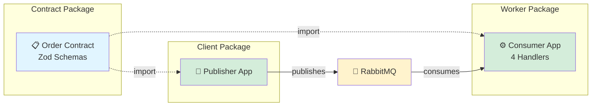
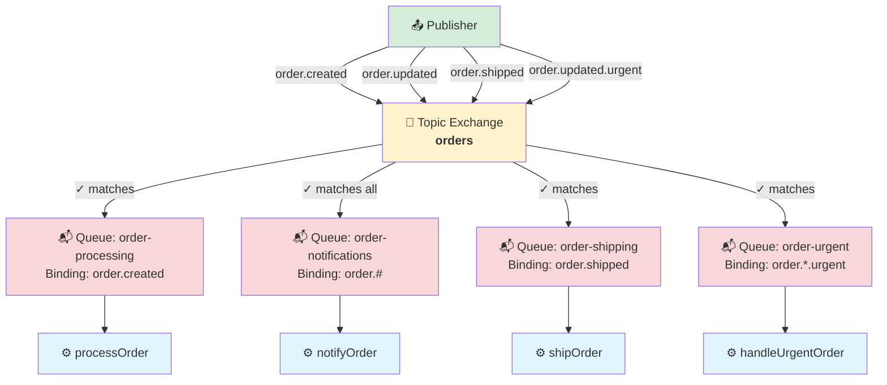
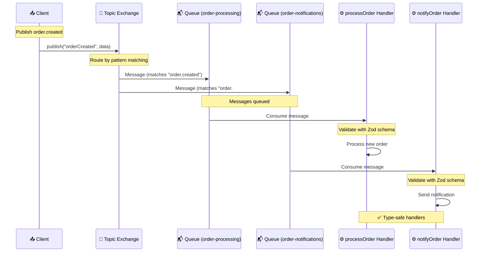

# Basic Order Processing

A complete example demonstrating type-safe AMQP messaging with the [RabbitMQ](https://www.rabbitmq.com/) topic pattern.

## Overview

This example showcases:

- ✅ Contract definition with [Zod](https://zod.dev/) schemas
- ✅ Type-safe message publishing
- ✅ Type-safe message consumption
- ✅ [RabbitMQ](https://www.rabbitmq.com/) topic exchange with wildcards
- ✅ Multiple consumers with different routing patterns
- ✅ Full end-to-end type safety

## Architecture

The example consists of three packages:

1. **Contract** - Shared contract definition
2. **Client** - Publisher application
3. **Worker** - Consumer application with multiple handlers



## Topic Exchange Pattern

This example demonstrates [RabbitMQ](https://www.rabbitmq.com/)'s powerful topic exchange pattern for flexible message routing.

### Routing Diagram



### Routing Keys

The example uses these routing keys:

- `order.created` - New orders
- `order.updated` - Regular status updates
- `order.shipped` - Shipped orders
- `order.*.urgent` - Urgent updates (wildcard pattern)

### Routing Patterns

#### Exact Match

- `order.created` → matches only `order.created` messages
- `order.shipped` → matches only `order.shipped` messages

#### Multiple Word Wildcard (`#`)

- `order.#` → matches zero or more words after "order."
  - ✅ Matches: `order.created`, `order.updated`, `order.shipped`, `order.updated.urgent`

#### Single Word Wildcard (`*`)

- `order.*.urgent` → matches any single word between "order." and ".urgent"
  - ✅ Matches: `order.created.urgent`, `order.updated.urgent`
  - ❌ Does NOT match: `order.created`, `order.updated`

## Running the Example

### Prerequisites

Start [RabbitMQ](https://www.rabbitmq.com/):

```bash
docker run -d --name rabbitmq -p 5672:5672 -p 15672:15672 rabbitmq:4-management
```

### Setup

Install dependencies and build:

```bash
pnpm install
pnpm build
```

### Run

Open two terminals:

**Terminal 1 - Start the worker:**

```bash
pnpm --filter @amqp-contract-examples/basic-order-processing-worker dev
```

**Terminal 2 - Run the client:**

```bash
pnpm --filter @amqp-contract-examples/basic-order-processing-client dev
```

### Expected Output

The client publishes 5 messages, and you'll see the worker process them according to the routing patterns:

**Client Output:**

```
1️⃣ Publishing NEW ORDER (order.created)
   ✓ Published order ORD-001
   → Will be received by: processing & notifications queues

2️⃣ Publishing ORDER UPDATE (order.updated)
   ✓ Published update for ORD-001
   → Will be received by: notifications queue only

3️⃣ Publishing ORDER SHIPPED (order.shipped)
   ✓ Published shipment for ORD-001
   → Will be received by: notifications & shipping queues

4️⃣ Publishing ANOTHER NEW ORDER (order.created)
   ✓ Published order ORD-002
   → Will be received by: processing & notifications queues

5️⃣ Publishing URGENT ORDER UPDATE (order.updated.urgent)
   ✓ Published urgent update for ORD-002
   → Will be received by: notifications & urgent queues
```

**Worker Output:**

```
Subscribed to:
  • order.created     → processOrder handler
  • order.#           → notifyOrder handler (all events)
  • order.shipped     → shipOrder handler
  • order.*.urgent    → handleUrgentOrder handler

[PROCESSING] New order received (ORD-001)
[NOTIFICATIONS] Event received (new_order: ORD-001)
[NOTIFICATIONS] Event received (status_update: ORD-001)
[SHIPPING] Shipment notification received (ORD-001)
[NOTIFICATIONS] Event received (new_order: ORD-002)
[PROCESSING] New order received (ORD-002)
[URGENT] Priority order update received! (ORD-002)
[NOTIFICATIONS] Event received (status_update: ORD-002)
```

## Contract Definition

The contract is defined in a separate package (`@amqp-contract-examples/basic-order-processing-contract`) that is shared between the client and worker.

### Message Schemas

**Order Schema** (for new orders):

```typescript
const orderSchema = z.object({
  orderId: z.string(),
  customerId: z.string(),
  items: z.array(
    z.object({
      productId: z.string(),
      quantity: z.number().int().positive(),
      price: z.number().positive(),
    }),
  ),
  totalAmount: z.number().positive(),
  createdAt: z.string().datetime(),
});
```

**Order Status Schema** (for updates):

```typescript
const orderStatusSchema = z.object({
  orderId: z.string(),
  status: z.enum(["processing", "shipped", "delivered", "cancelled"]),
  updatedAt: z.string().datetime(),
});
```

### Contract Structure

```typescript
// 1. Define resources first
const ordersExchange = defineExchange("orders");
const orderProcessingQueue = defineQueue("order-processing");
const orderNotificationsQueue = defineQueue("order-notifications");
const orderShippingQueue = defineQueue("order-shipping");
const orderUrgentQueue = defineQueue("order-urgent");

// 2. Define messages
const orderMessage = defineMessage(orderSchema, {
  summary: "Order created event",
  description: "Emitted when a new order is created",
});
const orderStatusMessage = defineMessage(orderStatusSchema);
const orderUnionMessage = defineMessage(z.union([orderSchema, orderStatusSchema]));

// 3. Define event publishers
const orderCreatedEvent = defineEventPublisher(ordersExchange, orderMessage, {
  routingKey: "order.created",
});
const orderShippedEvent = defineEventPublisher(ordersExchange, orderStatusMessage, {
  routingKey: "order.shipped",
});

// Virtual event publishers for consumers with different message types or patterns
const allOrderEvents = defineEventPublisher(ordersExchange, orderUnionMessage, {
  routingKey: "order.created",
});
const urgentOrderEvents = defineEventPublisher(ordersExchange, orderStatusMessage, {
  routingKey: "order.updated.urgent",
});

// 4. Compose contract - exchanges, queues, and bindings are auto-extracted
export const orderContract = defineContract({
  publishers: {
    orderCreated: orderCreatedEvent,
    orderShipped: orderShippedEvent,
    orderUpdated: definePublisher(ordersExchange, orderStatusMessage, {
      routingKey: "order.updated",
    }),
    orderUrgentUpdate: definePublisher(ordersExchange, orderStatusMessage, {
      routingKey: "order.updated.urgent",
    }),
  },
  consumers: {
    processOrder: defineEventConsumer(orderCreatedEvent, orderProcessingQueue),
    notifyOrder: defineEventConsumer(allOrderEvents, orderNotificationsQueue, {
      routingKey: "order.#",
    }),
    shipOrder: defineEventConsumer(orderShippedEvent, orderShippingQueue),
    handleUrgentOrder: defineEventConsumer(urgentOrderEvents, orderUrgentQueue, {
      routingKey: "order.*.urgent",
    }),
  },
});
```

## Client Implementation

The client is in a separate package (`@amqp-contract-examples/basic-order-processing-client`) that imports the contract:

```typescript
import { TypedAmqpClient } from "@amqp-contract/client";
import { orderContract } from "@amqp-contract-examples/basic-order-processing-contract";

const client = (
  await TypedAmqpClient.create({
    contract: orderContract,
    urls: ["amqp://localhost"],
  }).recover((e) => {
    throw e;
  })
).unwrap();

// Publish new order with explicit error handling
const result = await client.publish("orderCreated", {
  orderId: "ORD-001",
  customerId: "CUST-123",
  items: [{ productId: "PROD-A", quantity: 2, price: 29.99 }],
  totalAmount: 59.98,
  createdAt: new Date().toISOString(),
});

result.match({
  ok: () => console.log("Order published successfully"),
  err: (error) => {
    console.error("Failed to publish:", error.message);
    // Handle error appropriately
  },
  defect: (cause) => {
    throw cause;
  },
});

// Publish status update
const updateResult = await client.publish("orderUpdated", {
  orderId: "ORD-001",
  status: "processing",
  updatedAt: new Date().toISOString(),
});

updateResult.match({
  ok: () => console.log("Status update published"),
  err: (error) => console.error("Failed:", error),
  defect: (cause) => {
    throw cause;
  },
});
```

## Worker Implementation

The worker is in a separate package (`@amqp-contract-examples/basic-order-processing-worker`) that imports the contract:

```typescript
import { TypedAmqpWorker } from "@amqp-contract/worker";
import { connect } from "amqplib";
import { orderContract } from "@amqp-contract-examples/basic-order-processing-contract";

const connection = await connect("amqp://localhost");

const worker = (
  await TypedAmqpWorker.create({
    contract: orderContract,
    handlers: {
      processOrder: ({ payload }) => {
        console.log(`[PROCESSING] Order ${payload.orderId}`);
        console.log(`  Customer: ${payload.customerId}`);
        console.log(`  Total: $${payload.totalAmount}`);
        return Ok(undefined).toAsync();
      },

      notifyOrder: ({ payload }) => {
        console.log(`[NOTIFICATION] Order ${payload.orderId} event`);
        return Ok(undefined).toAsync();
      },

      shipOrder: ({ payload }) => {
        console.log(`[SHIPPING] Order ${payload.orderId} - ${payload.status}`);
        return Ok(undefined).toAsync();
      },

      handleUrgentOrder: ({ payload }) => {
        console.log(`[URGENT] Order ${payload.orderId} - ${payload.status}`);
        return Ok(undefined).toAsync();
      },
    },
    connection,
  }).recover((e) => {
    throw e;
  })
).unwrap();
```

## Message Routing Table

| Message Published | Routing Key            | Queues Receiving                              | Handlers Triggered               |
| ----------------- | ---------------------- | --------------------------------------------- | -------------------------------- |
| New Order         | `order.created`        | ✅ order-processing<br>✅ order-notifications | processOrder<br>notifyOrder      |
| Regular Update    | `order.updated`        | ✅ order-notifications                        | notifyOrder                      |
| Shipped Order     | `order.shipped`        | ✅ order-notifications<br>✅ order-shipping   | notifyOrder<br>shipOrder         |
| Urgent Update     | `order.updated.urgent` | ✅ order-notifications<br>✅ order-urgent     | notifyOrder<br>handleUrgentOrder |

## Message Flow Example

This sequence diagram shows how a message flows through the system:



## Key Takeaways

1. **Flexible Routing** - Topic patterns enable complex routing without code changes
2. **Type Safety** - TypeScript ensures correctness at compile time
3. **Validation** - Zod validates all messages at runtime
4. **Decoupling** - Publishers don't need to know about consumers
5. **Scalability** - Easy to add new routing patterns

## Source Code

The complete source code is available in the repository:

- [Contract](https://github.com/btravstack/amqp-contract/tree/main/examples/basic-order-processing-contract)
- [Client](https://github.com/btravstack/amqp-contract/tree/main/examples/basic-order-processing-client)
- [Worker](https://github.com/btravstack/amqp-contract/tree/main/examples/basic-order-processing-worker)

## Next Steps

- Try modifying the routing keys
- Add new publishers or consumers
- Learn about [Client Usage](/guide/client-usage) and [Worker Usage](/guide/worker-usage)
