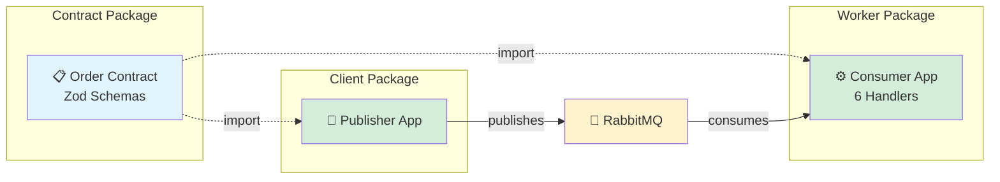
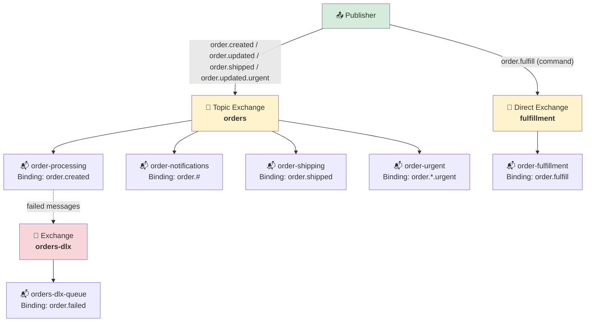
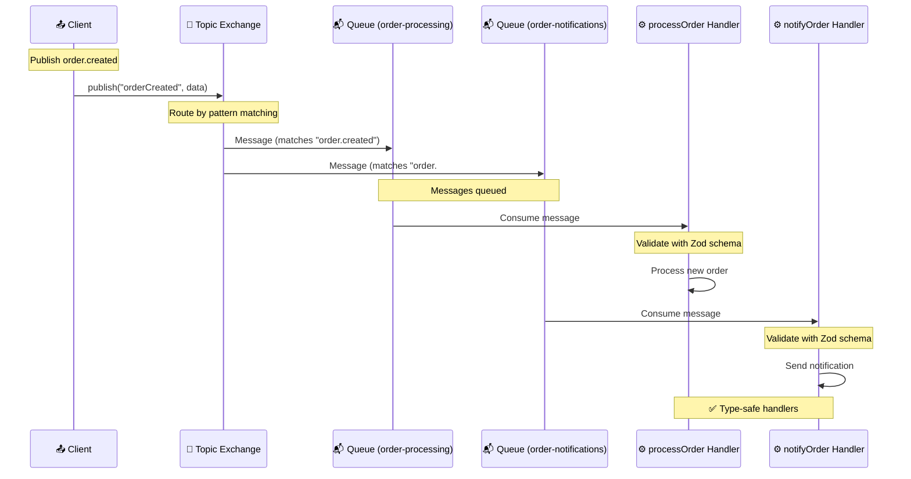

# Basic Order Processing

A complete example demonstrating type-safe AMQP messaging with the [RabbitMQ](https://www.rabbitmq.com/) topic pattern. This page is an annotated tour of the runnable code under [`examples/`](https://github.com/btravstack/amqp-contract/tree/main/examples) — the snippets below are taken from it, lightly trimmed.

## Overview

This example showcases:

- ✅ Contract definition with [Zod](https://zod.dev/) schemas
- ✅ Type-safe message publishing and consumption
- ✅ [RabbitMQ](https://www.rabbitmq.com/) topic exchange with wildcards
- ✅ Typed, validated message headers
- ✅ The event pattern **and** the command pattern (a task queue) in one contract
- ✅ A dead-letter exchange with its own consumer
- ✅ Raw queue arguments (`x-message-ttl`)

## Architecture

The example consists of three packages:

1. **Contract** - Shared contract definition
2. **Client** - Publisher application
3. **Worker** - Consumer application with six handlers


```mermaid
graph LR
    subgraph "Contract Package"
        Contract[📋 Order Contract<br/>Zod Schemas]
    end

    subgraph "Client Package"
        ClientApp[🚀 Publisher App]
    end

    subgraph "Worker Package"
        WorkerApp[⚙️ Consumer App<br/>6 Handlers]
    end

    Contract -.->|import| ClientApp
    Contract -.->|import| WorkerApp

    ClientApp -->|publishes| RabbitMQ[🐰 RabbitMQ]
    RabbitMQ -->|consumes| WorkerApp

    style Contract fill:#e1f5ff
    style ClientApp fill:#d4edda
    style WorkerApp fill:#d4edda
    style RabbitMQ fill:#fff3cd
```

## Topic Exchange Pattern

Events flow through the `orders` topic exchange; the fulfillment command flows through a dedicated `fulfillment` direct exchange; failures land on the `orders-dlx` dead-letter exchange.

### Routing Diagram


```mermaid
graph TB
    Publisher[📤 Publisher]

    Exchange["🔄 Topic Exchange<br/><b>orders</b>"]
    Fulfillment["🔄 Direct Exchange<br/><b>fulfillment</b>"]
    Dlx["🔄 Exchange<br/><b>orders-dlx</b>"]

    Q1["📬 order-processing<br/>Binding: order.created"]
    Q2["📬 order-notifications<br/>Binding: order.#"]
    Q3["📬 order-shipping<br/>Binding: order.shipped"]
    Q4["📬 order-urgent<br/>Binding: order.*.urgent"]
    Q5["📬 order-fulfillment<br/>Binding: order.fulfill"]
    Q6["📬 orders-dlx-queue<br/>Binding: order.failed"]

    Publisher -->|"order.created / order.updated / order.shipped / order.updated.urgent"| Exchange
    Publisher -->|"order.fulfill (command)"| Fulfillment
    Q1 -.->|"failed messages"| Dlx

    Exchange --> Q1
    Exchange --> Q2
    Exchange --> Q3
    Exchange --> Q4
    Fulfillment --> Q5
    Dlx --> Q6

    style Publisher fill:#d4edda
    style Exchange fill:#fff3cd
    style Fulfillment fill:#fff3cd
    style Dlx fill:#f8d7da
```

### Routing Keys

The example uses these routing keys:

- `order.created` - New orders (event)
- `order.updated` - Regular status updates (event)
- `order.shipped` - Shipped orders (event)
- `order.*.urgent` - Urgent updates (wildcard pattern)
- `order.fulfill` - Fulfillment command (task queue, direct exchange)
- `order.failed` - Dead-lettered messages (DLX)

### Routing Patterns

#### Exact Match

- `order.created` → matches only `order.created` messages
- `order.shipped` → matches only `order.shipped` messages

#### Multiple Word Wildcard (`#`)

- `order.#` → matches zero or more words after "order."
  - ✅ Matches: `order.created`, `order.updated`, `order.shipped`, `order.updated.urgent`

#### Single Word Wildcard (`*`)

- `order.*.urgent` → matches any single word between "order." and ".urgent"
  - ✅ Matches: `order.created.urgent`, `order.updated.urgent`
  - ❌ Does NOT match: `order.created`, `order.updated`

## Running the Example

### Prerequisites

Start [RabbitMQ](https://www.rabbitmq.com/):

```bash
docker run -d --name rabbitmq -p 5672:5672 -p 15672:15672 rabbitmq:4-management
```

### Setup

Install dependencies and build:

```bash
pnpm install
pnpm build
```

### Run

Open two terminals:

**Terminal 1 - Start the worker:**

```bash
pnpm --filter @amqp-contract-examples/basic-order-processing-worker dev
```

**Terminal 2 - Run the client:**

```bash
pnpm --filter @amqp-contract-examples/basic-order-processing-client dev
```

The client publishes four events (two `order.created`, one `order.updated`, one `order.shipped`, one `order.updated.urgent`) and sends one `order.fulfill` command; the worker logs each handler as messages arrive.

## Contract Definition

The contract lives in `@amqp-contract-examples/basic-order-processing-contract`, shared by the client and worker.

### Message Schemas

**Order Schema** (for new orders):

```typescript
const orderSchema = z.object({
  orderId: z.string(),
  customerId: z.string(),
  items: z.array(
    z.object({
      productId: z.string(),
      quantity: z.number().int().positive(),
      price: z.number().positive(),
    }),
  ),
  totalAmount: z.number().positive(),
  createdAt: z
    .string()
    .datetime()
    .default(() => new Date().toISOString()),
});
```

**Order Status Schema** (for updates):

```typescript
const orderStatusSchema = z.object({
  orderId: z.string(),
  status: z.enum(["processing", "shipped", "delivered", "cancelled"]),
  updatedAt: z
    .string()
    .datetime()
    .default(() => new Date().toISOString()),
});
```

**Fulfillment Command Schema** — a command is an instruction to do work, addressed to one owner:

```typescript
const fulfillmentSchema = z.object({
  orderId: z.string(),
  warehouseId: z.string(),
  priority: z.enum(["standard", "express"]).default("standard"),
});
```

**Typed Headers** — validated on consumption like any payload:

```typescript
const orderHeadersSchema = z.object({
  eventSource: z.string().default("order-service"),
  eventVersion: z.number().default(1),
});
```

### Contract Structure

```typescript
// 1. Define resources first
const ordersExchange = defineExchange("orders");
const ordersDlx = defineExchange("orders-dlx");
// A command targets a single owner, so a direct exchange fits.
const fulfillmentExchange = defineExchange("fulfillment", { type: "direct" });

const orderProcessingQueue = defineQueue("order-processing", {
  deadLetter: { exchange: ordersDlx, routingKey: "order.failed" },
  arguments: {
    "x-message-ttl": 86400000, // 24 hours
  },
});
const orderNotificationsQueue = defineQueue("order-notifications", {
  deadLetter: { exchange: ordersDlx, routingKey: "order.failed" },
});
const orderShippingQueue = defineQueue("order-shipping", {
  deadLetter: { exchange: ordersDlx, routingKey: "order.failed" },
});
const orderUrgentQueue = defineQueue("order-urgent", {
  deadLetter: { exchange: ordersDlx, routingKey: "order.failed" },
});
const orderFulfillmentQueue = defineQueue("order-fulfillment", {
  deadLetter: { exchange: ordersDlx, routingKey: "order.failed" },
});
// The DLQ is itself consumed, and cannot dead-letter to itself — so the drop
// is declared explicitly.
const ordersDlxQueue = defineQueue("orders-dlx-queue", { onPoison: "drop" });

// 2. Define messages
const orderMessage = defineMessage(orderSchema, {
  headers: orderHeadersSchema,
  summary: "Order created event",
  description: "Emitted when a new order is created in the system",
});
const orderStatusMessage = defineMessage(orderStatusSchema, {
  summary: "Order status update event",
  description: "Emitted when an order status changes",
});
const orderUnionMessage = defineMessage(z.union([orderSchema, orderStatusSchema]));
const fulfillmentMessage = defineMessage(fulfillmentSchema, {
  summary: "Order fulfillment command",
  description: "Instructs the fulfillment service to pick, pack, and ship an order",
});

// 3. Define event publishers
const orderCreatedEvent = defineEventPublisher(ordersExchange, orderMessage, {
  routingKey: "order.created",
});
const orderShippedEvent = defineEventPublisher(ordersExchange, orderStatusMessage, {
  routingKey: "order.shipped",
});

// Virtual event publishers exist only to type consumers with a different
// message type or a wildcard binding — they are not in the publishers section.
const allOrderEvents = defineEventPublisher(ordersExchange, orderUnionMessage, {
  routingKey: "order.created",
});
const urgentOrderEvents = defineEventPublisher(ordersExchange, orderStatusMessage, {
  routingKey: "order.updated.urgent",
});
const failedOrderEvent = defineEventPublisher(ordersDlx, orderMessage, {
  routingKey: "order.failed",
});

// 4. Command pattern: the consumer owns the queue; the publisher is derived
// from it, so callers cannot drift from the owner's contract.
const fulfillOrder = defineCommandConsumer(
  orderFulfillmentQueue,
  fulfillmentExchange,
  fulfillmentMessage,
  { routingKey: "order.fulfill" },
);
const requestFulfillment = defineCommandPublisher(fulfillOrder);

// 5. Compose contract - exchanges, queues, and bindings are auto-extracted
export const orderContract = defineContract({
  publishers: {
    orderCreated: orderCreatedEvent,
    orderShipped: orderShippedEvent,
    orderUpdated: definePublisher(ordersExchange, orderStatusMessage, {
      routingKey: "order.updated",
    }),
    orderUrgentUpdate: definePublisher(ordersExchange, orderStatusMessage, {
      routingKey: "order.updated.urgent",
    }),
    requestFulfillment,
  },
  consumers: {
    processOrder: defineEventConsumer(orderCreatedEvent, orderProcessingQueue),
    notifyOrder: defineEventConsumer(allOrderEvents, orderNotificationsQueue, {
      routingKey: "order.#",
    }),
    shipOrder: defineEventConsumer(orderShippedEvent, orderShippingQueue),
    handleUrgentOrder: defineEventConsumer(urgentOrderEvents, orderUrgentQueue, {
      routingKey: "order.*.urgent",
    }),
    handleFailedOrders: defineEventConsumer(failedOrderEvent, ordersDlxQueue),
    fulfillOrder,
  },
});
```

Five publishers, six consumers: four event publishers plus a derived command publisher; four event consumers plus a dead-letter consumer and the command consumer that owns the task queue.

## Client Implementation

The client (`@amqp-contract-examples/basic-order-processing-client`) imports the contract and publishes with full type inference. It also installs a publish interceptor so every publish is logged in one place:

```typescript
import { orderContract } from "@amqp-contract-examples/basic-order-processing-contract";
import { type PublishInterceptor, TypedAmqpClient } from "@amqp-contract/client";

// Logs every publish (before and after) instead of wrapping each call site.
const logPublishes: PublishInterceptor = (args, next) => {
  console.debug(`Publishing to ${args.publisherName}`);
  return next()
    .tap(() => console.debug(`Successfully published to ${args.publisherName}`))
    .tapFailure((failure) => console.error(`Failed to publish: ${args.publisherName}`, failure));
};

const client = await TypedAmqpClient.create({
  contract: orderContract,
  urls: ["amqp://localhost"],
  publishInterceptors: [logPublishes],
}).get();

// Publish a new order. publish() returns an AsyncResult; the demo extracts it
// with getOrThrow() — production code would usually .match() on the Result.
await client
  .publish("orderCreated", {
    orderId: "ORD-001",
    customerId: "CUST-123",
    items: [{ productId: "PROD-A", quantity: 2, price: 29.99 }],
    totalAmount: 59.98,
  })
  .getOrThrow();

// Publish with typed headers — validated against orderHeadersSchema
await client
  .publish(
    "orderCreated",
    {
      orderId: "ORD-002",
      customerId: "CUST-456",
      items: [{ productId: "PROD-C", quantity: 3, price: 15.99 }],
      totalAmount: 47.97,
    },
    { headers: { eventSource: "new-order-service", eventVersion: 2 } },
  )
  .getOrThrow();

// Send the fulfillment COMMAND — addressed to the single fulfillment worker,
// not broadcast. Payload type and routing key come from the command consumer.
await client
  .publish("requestFulfillment", {
    orderId: "ORD-001",
    warehouseId: "WH-EU-1",
    priority: "express",
  })
  .getOrThrow();

// Clean up
await client.close().get();
```

## Worker Implementation

The worker (`@amqp-contract-examples/basic-order-processing-worker`) provides one handler per consumer. Handlers return `AsyncResult<void, HandlerError>`; async work is wrapped with `fromPromise` and the `qualifyRetryable` factory:

```typescript
import { orderContract } from "@amqp-contract-examples/basic-order-processing-contract";
import { TypedAmqpWorker, declareHandlers, qualifyRetryable } from "@amqp-contract/worker";
import { fromPromise } from "unthrown";

const worker = await TypedAmqpWorker.create({
  contract: orderContract,
  handlers: declareHandlers(orderContract, {
    // Event handler for NEW orders (order.created) — headers are typed
    processOrder: ({ payload, headers }) => {
      console.log(`[PROCESSING] Order ${payload.orderId}`, {
        customer: payload.customerId,
        total: payload.totalAmount,
        eventSource: headers.eventSource,
        eventVersion: headers.eventVersion,
      });
      return fromPromise(processOrder(payload), qualifyRetryable("Processing failed")).map(
        () => undefined,
      );
    },

    // Event handler for ALL order events (order.#) — payload is the union type
    notifyOrder: ({ payload }) => {
      if ("items" in payload) {
        console.log(`[NOTIFICATIONS] New order ${payload.orderId}`);
      } else {
        console.log(`[NOTIFICATIONS] Status update ${payload.orderId}: ${payload.status}`);
      }
      return fromPromise(sendNotification(payload), qualifyRetryable("Notification failed")).map(
        () => undefined,
      );
    },

    // Event handler for SHIPPED orders (order.shipped)
    shipOrder: ({ payload }) => {
      console.log(`[SHIPPING] Order ${payload.orderId} - ${payload.status}`);
      return fromPromise(prepareShipping(payload), qualifyRetryable("Shipping failed")).map(
        () => undefined,
      );
    },

    // Event handler for URGENT orders (order.*.urgent)
    handleUrgentOrder: ({ payload }) => {
      console.warn(`[URGENT] Order ${payload.orderId} - ${payload.status}`);
      return fromPromise(escalate(payload), qualifyRetryable("Urgent handling failed")).map(
        () => undefined,
      );
    },

    // Command handler (task queue): reaches exactly one worker
    fulfillOrder: ({ payload }) => {
      console.log(`[FULFILLMENT] Order ${payload.orderId} → ${payload.warehouseId}`);
      return fromPromise(fulfill(payload), qualifyRetryable("Fulfillment failed")).map(
        () => undefined,
      );
    },

    // Dead-letter handler: messages that failed in order-processing
    handleFailedOrders: ({ payload }) => {
      console.error(`[DLX] Failed order ${payload.orderId}`);
      return fromPromise(recordFailure(payload), qualifyRetryable("DLX handling failed")).map(
        () => undefined,
      );
    },
  }),
  urls: ["amqp://localhost"],
}).get();

// Graceful shutdown: drain in-flight handlers, then close
process.on("SIGINT", async () => {
  await worker.close().get();
  process.exit(0);
});
```

The runnable version also chains `.tapDefect(...)` before `.get()` to log infrastructure failures during creation, and uses [pino](https://getpino.io/) instead of `console`.

## Message Routing Table

| Message Published   | Routing Key            | Exchange      | Queues Receiving                              | Handlers Triggered               |
| ------------------- | ---------------------- | ------------- | --------------------------------------------- | -------------------------------- |
| New Order           | `order.created`        | `orders`      | ✅ order-processing<br>✅ order-notifications | processOrder<br>notifyOrder      |
| Regular Update      | `order.updated`        | `orders`      | ✅ order-notifications                        | notifyOrder                      |
| Shipped Order       | `order.shipped`        | `orders`      | ✅ order-notifications<br>✅ order-shipping   | notifyOrder<br>shipOrder         |
| Urgent Update       | `order.updated.urgent` | `orders`      | ✅ order-notifications<br>✅ order-urgent     | notifyOrder<br>handleUrgentOrder |
| Fulfillment Command | `order.fulfill`        | `fulfillment` | ✅ order-fulfillment                          | fulfillOrder                     |
| Failed Message      | `order.failed`         | `orders-dlx`  | ✅ orders-dlx-queue                           | handleFailedOrders               |

## Message Flow Example

This sequence diagram shows how a message flows through the system:


```mermaid
sequenceDiagram
    participant Client as 📤 Client
    participant Exchange as 🔄 Topic Exchange
    participant Q1 as 📬 Queue (order-processing)
    participant Q2 as 📬 Queue (order-notifications)
    participant H1 as ⚙️ processOrder Handler
    participant H2 as ⚙️ notifyOrder Handler

    Note over Client: Publish order.created

    Client->>Exchange: publish("orderCreated", data)
    Note over Exchange: Route by pattern matching

    Exchange->>Q1: Message (matches "order.created")
    Exchange->>Q2: Message (matches "order.#")

    Note over Q1,Q2: Messages queued

    Q1->>H1: Consume message
    Note over H1: Validate with Zod schema
    H1->>H1: Process new order

    Q2->>H2: Consume message
    Note over H2: Validate with Zod schema
    H2->>H2: Send notification

    Note over H1,H2: ✅ Type-safe handlers
```

## Key Takeaways

1. **Flexible Routing** - Topic patterns enable complex routing without code changes
2. **Two Patterns, One Contract** - Broadcast events and a single-owner task queue coexist
3. **Type Safety** - TypeScript ensures correctness at compile time, headers included
4. **Validation** - Zod validates all messages (and headers) at runtime
5. **Failure Handling** - The DLX queue has a consumer, so failed messages are observed, not lost

## Source Code

The complete source code is available in the repository:

- [Contract](https://github.com/btravstack/amqp-contract/tree/main/examples/basic-order-processing-contract)
- [Client](https://github.com/btravstack/amqp-contract/tree/main/examples/basic-order-processing-client)
- [Worker](https://github.com/btravstack/amqp-contract/tree/main/examples/basic-order-processing-worker)

## Next Steps

- Try modifying the routing keys
- Add new publishers or consumers
- Learn about [publishing messages](/how-to/publish-messages) and [consuming messages](/how-to/consume-messages)
