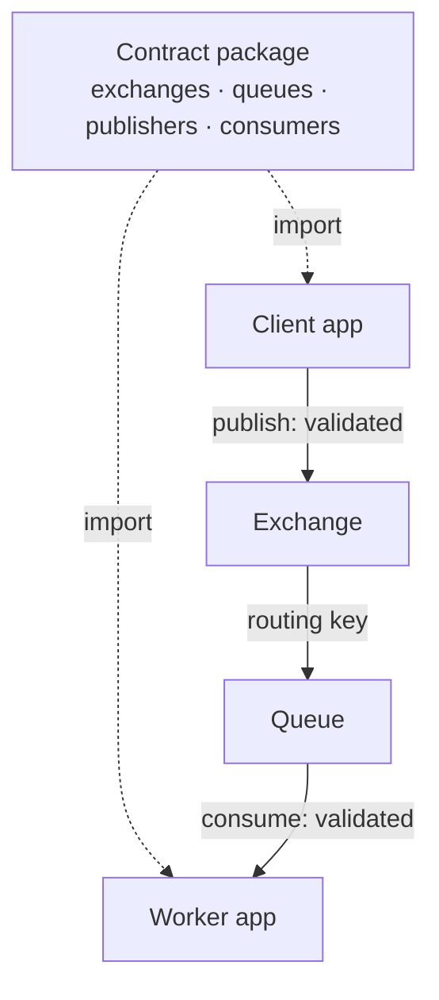

# Examples

Annotated tours of example projects. The [basic order processing](/examples/basic-order-processing) example is backed by the runnable code under [`examples/`](https://github.com/btravstack/amqp-contract/tree/main/examples), which compiles and is covered by integration tests. The [command pattern](/examples/command-pattern) page is an illustrative walkthrough of a fictional payment service.

If you are starting out, do the [tutorial](/tutorial/getting-started) first — it builds a working publisher and consumer from nothing.

## [Basic order processing](/examples/basic-order-processing)

A topic exchange with several consumers on different routing patterns: wildcard subscriptions, typed headers, a dead-letter exchange, and both the event and command patterns in one contract.

The best thing to read if you want a realistic contract rather than a minimal one.

## [Command pattern](/examples/command-pattern)

A task queue — many callers, one owner. Shows why the command pattern inverts the definition order, and how `defineCommandPublisher` derives the caller's side from the consumer.

## Run them

```bash
git clone https://github.com/btravstack/amqp-contract.git
cd amqp-contract
pnpm install
pnpm build
docker run -d --name rabbitmq -p 5672:5672 -p 15672:15672 rabbitmq:4-management
```

```bash
# Terminal 1: the worker
pnpm --filter @amqp-contract-examples/basic-order-processing-worker dev

# Terminal 2: the client
pnpm --filter @amqp-contract-examples/basic-order-processing-client dev
```

## How they are laid out

```
examples/
├── basic-order-processing-contract/   # the shared contract
├── basic-order-processing-client/     # publisher, depends on the contract
└── basic-order-processing-worker/     # consumer, depends on the contract
```



The three-package split is the point. A contract in its own package, depended on by both sides, is what makes a rename break the publisher and the consumer at the same time — see [define a contract](/how-to/define-a-contract#share-a-contract-between-services).

## Generate AsyncAPI from them

The contract package carries the generation scripts:

```bash
pnpm --filter @amqp-contract-examples/basic-order-processing-contract generate:asyncapi:json
```

See [generate AsyncAPI](/how-to/generate-asyncapi).
