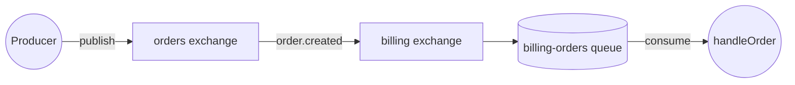

# Bridge Exchanges

A **bridge exchange** routes messages across domain boundaries by going through a local exchange that forwards to (or receives from) a remote one. The pattern keeps each domain's contract self-contained: your service references _its own_ exchanges, and amqp-contract auto-generates the exchange-to-exchange (e2e) bindings that connect them.

This page covers the two directions: **consuming** events that originate in another domain, and **publishing** commands into one.

## When to use it

Reach for a bridge exchange when:

- You want one service to **subscribe to events from another domain** without coupling its contract to that domain's exchange topology.
- You want to **publish a command into a remote domain's queue** without your local code holding a direct reference to a remote exchange.
- You need a **single seam** for cross-team auditing, security, or routing rules — bridges give you a place to attach those.

If both producer and consumer live in the same codebase, you don't need a bridge — just share the exchange definition.

## Consuming events through a bridge

The remote `orders` domain publishes `order.created` on its `orders` exchange. Your `billing` service wants those events on its own queue, without mentioning `orders` directly in its day-to-day code.

```ts
import {
  defineExchange,
  defineQueue,
  defineMessage,
  defineEventPublisher,
  defineEventConsumer,
  defineContract,
} from "@amqp-contract/contract";
import { z } from "zod";

// Remote domain's exchange (you reference it once to declare the bridge)
const ordersExchange = defineExchange("orders");

// Local exchange in the billing domain — the bridge
const billingExchange = defineExchange("billing");

// Local queue for billing's consumer
const billingQueue = defineQueue("billing-orders");

const orderMessage = defineMessage(z.object({ orderId: z.string(), amount: z.number() }));

const orderCreated = defineEventPublisher(ordersExchange, orderMessage, {
  routingKey: "order.created",
});

export const contract = defineContract({
  consumers: {
    handleOrder: defineEventConsumer(orderCreated, billingQueue, {
      bridgeExchange: billingExchange,
    }),
  },
});
```

This generates:



`defineContract` automatically extracts:

- both exchanges (`orders` and `billing`)
- a queue-to-exchange binding (`billing-orders` ← `billing`)
- an **exchange-to-exchange** binding (`billing` ← `orders`, routing key `order.created`)

Your handler stays unchanged from the non-bridged version.

## Publishing commands through a bridge

The reverse direction. The remote `inventory` domain owns a queue you want to send commands to. Your local domain publishes through a local exchange that forwards to the remote one.

```ts
import {
  defineExchange,
  defineQueue,
  defineMessage,
  defineCommandConsumer,
  defineCommandPublisher,
  defineContract,
} from "@amqp-contract/contract";
import { z } from "zod";

// Remote domain
const inventoryExchange = defineExchange("inventory");
const inventoryQueue = defineQueue("inventory-commands");

// Local bridge
const localExchange = defineExchange("ordering-out");

const reserveMessage = defineMessage(z.object({ sku: z.string(), quantity: z.number() }));

const reserveCommand = defineCommandConsumer(inventoryQueue, inventoryExchange, reserveMessage, {
  routingKey: "inventory.reserve",
});

export const contract = defineContract({
  publishers: {
    reserveStock: defineCommandPublisher(reserveCommand, {
      bridgeExchange: localExchange,
    }),
  },
});
```

The publisher publishes to `localExchange` (`ordering-out`); the auto-generated e2e binding forwards to `inventoryExchange`. Your code calls `client.publish("reserveStock", { ... })` — it never names the remote exchange in the publish path.

## Compatibility rules

Bridge exchanges and source/destination exchanges must have **compatible types**:

- `fanout` ↔ `fanout`
- `topic` / `direct` ↔ `topic` / `direct`
- `headers` ↔ `headers`

You'll get a type error at `defineEventConsumer` / `defineCommandPublisher` time if you try to bridge incompatible types.

## What ends up in your AsyncAPI spec

The [AsyncAPI generator](./asyncapi-generation.md) surfaces bridge bindings on both source and destination exchange channels:

- The channel description includes a human-readable summary (`forwards to 'billing'`, `receives from 'orders'`).
- A `x-amqp-exchange-bindings` extension carries the structured form:
  ```yaml
  x-amqp-exchange-bindings:
    forwardsTo:
      - destination: billing
        routingKey: order.created
  ```

That gives you a single source of truth for cross-domain routing without leaving the contract.

## When _not_ to use a bridge

- **Same codebase**: just share the exchange definition. Bridges add a hop and an exchange you have to maintain.
- **One-off forwarding**: if you'll never have more than one consumer in a domain, point the queue directly at the source exchange.
- **Performance-critical paths**: each bridge adds a publish step. For high-fan-out events, native bindings between source exchange and target queues are cheaper.

## See also

- [Contract patterns](./defining-contracts.md) — event vs command pattern fundamentals.
- [AsyncAPI Generation](./asyncapi-generation.md) — how bridges appear in the generated spec.
