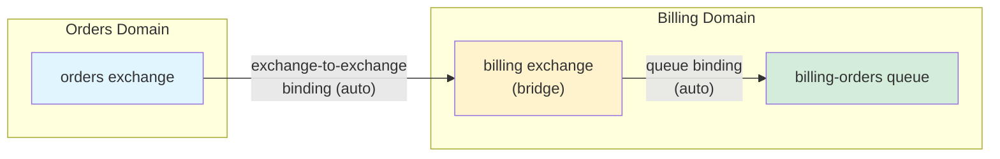
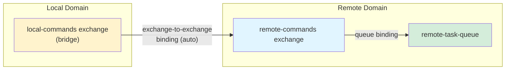

# Defining Contracts

Learn how to define AMQP contracts with full type safety.

## Recommended Approach: Event and Command Patterns

::: tip RECOMMENDED
For robust contract definitions with guaranteed consistency, use **Event** or **Command** patterns. These patterns ensure message schema and routing key consistency between publishers and consumers.
:::

| Pattern     | Use Case                                   | Flow                                               |
| ----------- | ------------------------------------------ | -------------------------------------------------- |
| **Event**   | One publisher, many consumers (broadcast)  | `defineEventPublisher` → `defineEventConsumer`     |
| **Command** | Many publishers, one consumer (task queue) | `defineCommandConsumer` → `defineCommandPublisher` |

### Event Pattern (Broadcast)

Use this pattern for **events** where publishers broadcast messages without knowing who consumes them. Multiple consumers can subscribe to the same event:

```typescript
import {
  defineEventPublisher,
  defineEventConsumer,
  defineContract,
  defineExchange,
  defineQueue,
  defineMessage,
} from "@amqp-contract/contract";
import { z } from "zod";

// Define exchange and message
const ordersExchange = defineExchange("orders");
const orderMessage = defineMessage(
  z.object({
    orderId: z.string().uuid(),
    amount: z.number().positive(),
  }),
);

// Event pattern: define publisher that broadcasts events
const orderCreatedEvent = defineEventPublisher(ordersExchange, orderMessage, {
  routingKey: "order.created",
});

// Multiple queues can consume the same event
const orderQueue = defineQueue("order-processing");
const analyticsQueue = defineQueue("analytics");

// Compose contract - only publishers and consumers needed
// Exchanges, queues, and bindings are automatically extracted
export const contract = defineContract({
  publishers: {
    orderCreated: orderCreatedEvent,
  },
  consumers: {
    processOrder: defineEventConsumer(orderCreatedEvent, orderQueue),
    trackOrder: defineEventConsumer(orderCreatedEvent, analyticsQueue),
  },
});
```

**Benefits:**

- ✅ Publishers don't need to know about queues (true event-oriented)
- ✅ Multiple consumers can subscribe to the same event
- ✅ Guaranteed message schema consistency
- ✅ Automatic routing key synchronization

#### Topic Exchange with Event Pattern

For topic exchanges, consumers can optionally override the routing key with their own binding patterns:

```typescript
// Publisher uses a concrete routing key
const orderCreatedEvent = defineEventPublisher(
  ordersExchange, // topic exchange
  orderMessage,
  { routingKey: "order.created" },
);

// Compose contract - consumers can use different patterns
export const contract = defineContract({
  publishers: {
    orderCreated: orderCreatedEvent,
  },
  consumers: {
    // Uses default 'order.created' routing key
    processExactOrder: defineEventConsumer(orderCreatedEvent, exactMatchQueue),
    // Override with pattern to receive any 'order.*' messages
    processAllOrders: defineEventConsumer(orderCreatedEvent, allOrdersQueue, {
      routingKey: "order.*",
    }),
  },
});
```

**Pattern Matching:**

- `*` matches exactly one word (e.g., `order.*` matches `order.created` but not `order.item.shipped`)
- `#` matches zero or more words (e.g., `order.#` matches `order.created`, `order.item.shipped`, etc.)

### Command Pattern (Task Queue)

Use this pattern for **commands** where the consumer "owns" the queue and publishers send commands to it:

```typescript
import {
  defineCommandConsumer,
  defineCommandPublisher,
  defineContract,
  defineQueue,
  defineExchange,
  defineMessage,
} from "@amqp-contract/contract";
import { z } from "zod";

// Define queue, exchange, and message
const taskQueue = defineQueue("tasks");
const tasksExchange = defineExchange("tasks", { type: "direct" });
const taskMessage = defineMessage(
  z.object({
    taskId: z.string(),
    action: z.string(),
  }),
);

// Command pattern: consumer owns the queue and defines what it accepts
const executeTaskCommand = defineCommandConsumer(taskQueue, tasksExchange, taskMessage, {
  routingKey: "task.execute",
});

// Publishers send commands to the consumer
const executeTaskPublisher = defineCommandPublisher(executeTaskCommand);

// Compose contract - only publishers and consumers needed
// Exchanges, queues, and bindings are automatically extracted
export const contract = defineContract({
  publishers: {
    executeTask: executeTaskPublisher,
  },
  consumers: {
    processTask: executeTaskCommand,
  },
});
```

**Benefits:**

- ✅ Consumer defines the contract (command pattern)
- ✅ Publishers automatically match consumer expectations
- ✅ Guaranteed message schema consistency
- ✅ Routing key type validation at compile time

#### Topic Exchange with Command Pattern

For topic exchanges, the consumer binding can use patterns with wildcards, and publishers can specify concrete routing keys that match the pattern:

```typescript
// Consumer binds with a pattern
const processOrdersCommand = defineCommandConsumer(
  orderQueue,
  ordersExchange, // topic exchange
  orderMessage,
  { routingKey: "order.*" }, // Pattern with wildcard
);

// Publishers can use concrete keys that match the pattern
const createOrderPublisher = defineCommandPublisher(processOrdersCommand, {
  routingKey: "order.created",
});
const updateOrderPublisher = defineCommandPublisher(processOrdersCommand, {
  routingKey: "order.updated",
});
const shipOrderPublisher = defineCommandPublisher(processOrdersCommand, {
  routingKey: "order.shipped",
});

export const contract = defineContract({
  publishers: {
    orderCreated: createOrderPublisher, // Matches order.*
    orderUpdated: updateOrderPublisher, // Matches order.*
    orderShipped: shipOrderPublisher, // Matches order.*
  },
  consumers: {
    processOrders: processOrdersCommand,
  },
});
```

**Pattern Matching:**

- `*` matches exactly one word (e.g., `order.*` matches `order.created` but not `order.item.shipped`)
- `#` matches zero or more words (e.g., `order.#` matches `order.created`, `order.item.shipped`, etc.)

## Contract Structure

`defineContract` accepts two properties:

```typescript
const contract = defineContract({
  publishers: {
    /* ... */
  },
  consumers: {
    /* ... */
  },
});
```

The resulting contract object contains five parts — `exchanges`, `queues`, `bindings`, `publishers`, and `consumers` — all automatically extracted from the publisher and consumer definitions you provide.

## Composition Pattern

amqp-contract uses a **composition pattern**:

1. **Define resources first** - Create exchanges, queues, and messages as variables
2. **Reference objects** - Use these objects (not strings) in bindings, publishers, and consumers
3. **Compose together** - Combine everything in `defineContract`

**Benefits:**

- ✅ Better type safety - TypeScript validates exchange/queue types
- ✅ Better refactoring - Rename in one place
- ✅ DRY principle - Define once, reference many times

## Defining Exchanges

Exchanges route messages to queues. By default, exchanges are created as **topic exchanges** and are durable:

```typescript
import { defineExchange } from "@amqp-contract/contract";

// Define exchanges as variables
const ordersExchange = defineExchange("orders");

const notificationsExchange = defineExchange("notifications", { type: "fanout" });

// Exchanges are automatically included in the contract output
// when referenced by publishers or consumers
```

**Exchange Types:**

- `topic` (default) - Routes by routing key patterns (wildcards `*` and `#`)
- `direct` - Routes by exact routing key match
- `fanout` - Routes to all bound queues (ignores routing keys)
- `headers` - Routes based on message headers (ignores routing keys)

## Defining Queues

Queues store messages. By default, queues are created as **quorum queues** which provide better durability and high-availability using the Raft consensus algorithm.

```typescript
import { defineQueue } from "@amqp-contract/contract";

// Quorum queue (default, recommended for production)
const orderProcessingQueue = defineQueue("order-processing");

// Explicit quorum queue with options
const orderProcessingQueueExplicit = defineQueue("order-processing", {
  type: "quorum", // Default - provides better durability and HA
});

// Classic queue (for special cases like non-durable or priority queues)
const tempQueue = defineQueue("temp-queue", {
  type: "classic",
  durable: false, // Only supported with classic queues
  autoDelete: true, // Only supported with classic queues
});

// Queues are automatically included in the contract output
// when referenced by consumers
```

**Queue Types:**

- `quorum` (default) - Quorum queues provide better durability and high-availability. They are always durable and do not support exclusive, auto-deleting, or priority queues.
- `classic` - Traditional RabbitMQ queue type. Use when you need non-durable, exclusive, auto-deleting, or priority queues.

::: tip Best Practice
Use quorum queues (the default) for production workloads. Only use classic queues when you need specific features not supported by quorum queues.
:::

### Retry Configuration

Configure automatic retry behavior at the queue level using the `retry` option. This determines how failed messages are handled by the worker.

#### Immediate-Requeue Mode

Use `immediate-requeue` mode to requeue failed messages immediately:

```typescript
import { defineQueue, defineExchange } from "@amqp-contract/contract";

const dlx = defineExchange("orders-dlx");

const orderQueue = defineQueue("order-processing", {
  type: "quorum",
  deadLetter: { exchange: dlx },
  retry: { mode: "immediate-requeue", maxRetries: 3 }, // Dead-letter after 3 retry attempts
});
```

**Benefits:**

- **Simpler architecture** - No wait queues needed
- **No head-of-queue blocking** - Messages are requeued immediately

::: warning Note
Quorum queues may also limit the number of allowed requeues according to the delivery limit policy (defaults to `20` in RabbitMQ 4).
If needed, you can configure the delivery limit in the queue arguments:
:::

```typescript
import { defineQueue, defineExchange } from "@amqp-contract/contract";

const dlx = defineExchange("orders-dlx");

const orderQueue = defineQueue("order-processing", {
  type: "quorum",
  deadLetter: { exchange: dlx },
  retry: { mode: "immediate-requeue", maxRetries: 3 },
  arguments: { "x-delivery-limit": 20 },
});
```

#### TTL-Backoff Mode

For exponential backoff with delays between retries, use `ttl-backoff` mode:

```typescript
import { defineQueue, defineExchange } from "@amqp-contract/contract";

const dlx = defineExchange("orders-dlx");

const orderQueue = defineQueue("order-processing", {
  deadLetter: { exchange: dlx },
  retry: {
    mode: "ttl-backoff",
    maxRetries: 5,
    initialDelayMs: 1000, // Start with 1 second delay
    maxDelayMs: 60000, // Cap at 60 seconds
    backoffMultiplier: 2, // Double delay each retry
    jitter: true, // Add randomness to prevent thundering herd
  },
});
```

When you use `ttl-backoff` mode, `defineContract` automatically generates:

- A wait queue (`{queueName}-wait`) with per-message TTL, holding messages during backoff delay
- A wait headers exchange (`wait-exchange`) used to route messages to the wait queue
- A retry headers exchange (`retry-exchange`) used to route messages back to the main queue
- Bindings to route messages through the headers exchanges for retry

**Benefits:**

- **Exponential backoff** - Give failing services time to recover
- **Jitter support** - Prevents thundering herd problems

**Default values for TTL-backoff:**

| Option              | Default            | Description                        |
| ------------------- | ------------------ | ---------------------------------- |
| `maxRetries`        | 3                  | Maximum retry attempts             |
| `initialDelayMs`    | 1000               | Initial delay in milliseconds      |
| `maxDelayMs`        | 30000              | Maximum delay cap in milliseconds  |
| `backoffMultiplier` | 2                  | Multiplier for exponential backoff |
| `jitter`            | true               | Add randomness to delays           |
| `waitQueueName`     | `{queueName}-wait` | Name of the wait queue             |
| `waitExchangeName`  | `wait-exchange`    | Name of the wait exchange          |
| `retryExchangeName` | `retry-exchange`   | Name of the retry exchange         |

See the [Worker Usage Guide](/guide/worker-usage#retry-strategies) for more details on retry behavior.

## Defining Messages

Messages wrap schemas with optional metadata:

```typescript
import { defineMessage } from "@amqp-contract/contract";
import { z } from "zod";

const orderMessage = defineMessage(
  z.object({
    orderId: z.string(),
    customerId: z.string(),
    amount: z.number().positive(),
  }),
  {
    summary: "Order created event",
    description: "Emitted when a new order is created",
  },
);
```

**Benefits:**

- Enables AsyncAPI documentation
- Improves code readability
- Allows header schema definition (see below)

### Message Headers

Messages can include a **headers schema** in addition to the payload schema. Headers are validated at runtime on the **consumer side**, just like payloads.

Use headers for cross-cutting metadata that isn't part of the business payload — correlation IDs, tracing context, priority hints, or tenant identifiers.

```typescript
import { defineMessage } from "@amqp-contract/contract";
import { z } from "zod";

const orderMessage = defineMessage(
  z.object({
    orderId: z.string().uuid(),
    amount: z.number().positive(),
  }),
  {
    headers: z.object({
      correlationId: z.string().uuid(),
      priority: z.enum(["low", "medium", "high"]).optional(),
      tenantId: z.string(),
    }),
    summary: "Order created event",
  },
);
```

When a headers schema is defined, the consumer handler receives validated headers alongside the payload:

```typescript
import { defineHandlers } from "@amqp-contract/worker";

const handlers = defineHandlers(contract, {
  processOrder: (message) => {
    // message.payload is typed: { orderId: string, amount: number }
    // message.headers is typed: { correlationId: string, priority?: "low" | "medium" | "high", tenantId: string }
    console.log(
      `Processing order ${message.payload.orderId} for tenant ${message.headers.tenantId}`,
    );

    return ok(undefined).toAsync();
  },
});
```

If no headers schema is defined, `message.headers` is `undefined`.

Learn more about schema libraries:

- [Zod](https://zod.dev/)
- [Valibot](https://valibot.dev/)
- [ArkType](https://arktype.io/)

## Bindings

Bindings connect queues to exchanges. With `defineContract`, bindings are **automatically generated** from event and command consumer patterns:

```typescript
const ordersExchange = defineExchange("orders");
const orderProcessingQueue = defineQueue("order-processing");
const allOrdersQueue = defineQueue("all-orders");

const orderCreatedEvent = defineEventPublisher(ordersExchange, orderMessage, {
  routingKey: "order.created",
});

const contract = defineContract({
  publishers: {
    orderCreated: orderCreatedEvent,
  },
  consumers: {
    // Binding auto-generated: orderProcessingQueue → ordersExchange (order.created)
    processOrder: defineEventConsumer(orderCreatedEvent, orderProcessingQueue),
    // Binding auto-generated with override: allOrdersQueue → ordersExchange (order.*)
    processAllOrders: defineEventConsumer(orderCreatedEvent, allOrdersQueue, {
      routingKey: "order.*",
    }),
  },
});
```

**Routing Key Requirements:**

- **Fanout/Headers**: Routing key is optional (and ignored)
- **Direct/Topic**: Routing key is required

TypeScript enforces these rules at compile time!

## Defining Publishers

Publishers define message schemas for publishing. Use `defineEventPublisher` (recommended) or `definePublisher`:

```typescript
import { defineEventPublisher, definePublisher, defineMessage } from "@amqp-contract/contract";
import { z } from "zod";

const ordersExchange = defineExchange("orders");

const orderMessage = defineMessage(
  z.object({
    orderId: z.string().uuid(),
    customerId: z.string().uuid(),
    amount: z.number().positive(),
    createdAt: z.string().datetime(),
  }),
);

// Recommended: Event publisher (enables defineEventConsumer with auto-binding)
const orderCreatedEvent = defineEventPublisher(ordersExchange, orderMessage, {
  routingKey: "order.created",
});

// Alternative: Plain publisher (no auto-binding for consumers)
const orderUpdatedPublisher = definePublisher(ordersExchange, orderMessage, {
  routingKey: "order.updated",
});

const contract = defineContract({
  publishers: {
    orderCreated: orderCreatedEvent,
    orderUpdated: orderUpdatedPublisher,
  },
  consumers: {
    /* ... */
  },
});
```

**Routing Key Requirements:**

- **Fanout/Headers**: Optional
- **Direct/Topic**: Required

## Defining Consumers

Consumers define message schemas for consuming. Use `defineEventConsumer` (recommended) or `defineConsumer`:

```typescript
import { defineEventConsumer, defineConsumer, defineMessage } from "@amqp-contract/contract";
import { z } from "zod";

const orderProcessingQueue = defineQueue("order-processing");

const orderMessage = defineMessage(
  z.object({
    orderId: z.string().uuid(),
    customerId: z.string().uuid(),
    amount: z.number().positive(),
    createdAt: z.string().datetime(),
  }),
);

// Recommended: Event consumer (auto-generates binding from publisher's exchange)
const orderCreatedEvent = defineEventPublisher(ordersExchange, orderMessage, {
  routingKey: "order.created",
});

// Alternative: Plain consumer (no auto-binding)
const plainConsumer = defineConsumer(orderProcessingQueue, orderMessage);

const contract = defineContract({
  publishers: { orderCreated: orderCreatedEvent },
  consumers: {
    processOrder: defineEventConsumer(orderCreatedEvent, orderProcessingQueue),
  },
});
```

## Complete Example

```typescript
import {
  defineContract,
  defineEventConsumer,
  defineEventPublisher,
  defineExchange,
  defineMessage,
  defineQueue,
} from "@amqp-contract/contract";
import { z } from "zod";

// 1. Define exchange
const ordersExchange = defineExchange("orders");

// 2. Define queues
const orderProcessingQueue = defineQueue("order-processing");
const orderNotificationsQueue = defineQueue("order-notifications");

// 3. Define message
const orderMessage = defineMessage(
  z.object({
    orderId: z.string(),
    customerId: z.string(),
    amount: z.number(),
  }),
);

// 4. Define event publisher
const orderCreatedEvent = defineEventPublisher(ordersExchange, orderMessage, {
  routingKey: "order.created",
});

// 5. Compose contract - exchanges, queues, and bindings are auto-extracted
export const contract = defineContract({
  publishers: {
    orderCreated: orderCreatedEvent,
  },
  consumers: {
    processOrder: defineEventConsumer(orderCreatedEvent, orderProcessingQueue),
    notifyOrder: defineEventConsumer(orderCreatedEvent, orderNotificationsQueue),
  },
});
```

## Exchange-to-Exchange Bindings

Exchange-to-exchange bindings route messages from one exchange to another. The most common use case is **bridge exchanges** for cross-domain communication (see [Bridge Exchange](#bridge-exchange-cross-domain-communication) below), where bindings are **automatically generated** by `defineContract`.

For other advanced routing scenarios, you can set up exchange-to-exchange bindings manually via the `AmqpClient`'s channel setup:

```typescript
import { defineExchangeBinding } from "@amqp-contract/contract";

const sourceExchange = defineExchange("source");
const destExchange = defineExchange("destination");

// Exchange-to-exchange binding definition
const crossExchangeBinding = defineExchangeBinding(destExchange, sourceExchange, {
  routingKey: "order.#",
});

// Set up manually via AmqpClient's channel options
const client = new AmqpClient(contract, {
  urls: ["amqp://localhost"],
  channelOptions: {
    setup: async (channel) => {
      await channel.assertExchange("source", "topic");
      await channel.assertExchange("destination", "topic");
      await channel.bindExchange("destination", "source", "order.#");
    },
  },
});
```

## When to Use Each Approach

### Use Event / Command Patterns (Recommended)

✅ **Use for most cases** - Provides consistency guarantees and prevents runtime errors

- Event-driven architectures (use `defineEventPublisher` → `defineEventConsumer`)
- Command patterns (use `defineCommandConsumer` → `defineCommandPublisher`)
- When you want guaranteed message schema consistency
- When you want automatic routing key synchronization

### Use Basic Definition (Advanced)

Use `definePublisher` and `defineConsumer` (without event/command patterns) only when:

- You're working with complex routing patterns that don't fit the event/command model
- You're integrating with existing AMQP infrastructure with specific requirements

::: warning
When using basic definitions:

- No bindings are auto-generated (you must set up bindings manually)
- You must ensure publishers and consumers use the same message schemas
- Use exchange-to-exchange bindings via `AmqpClient` channel setup
  :::

## Type Validation Utilities

amqp-contract exports advanced utility types for validating routing keys and binding patterns at compile time:

```typescript
import { RoutingKey, BindingPattern, MatchingRoutingKey } from "@amqp-contract/contract";

// Validate routing key format and character set
type ValidKey = RoutingKey<"order.created">; // ✅ 'order.created'
type InvalidKey = RoutingKey<"order..bad">; // ❌ never (empty segment)

// Validate binding pattern with wildcards
type ValidPattern = BindingPattern<"order.*">; // ✅ 'order.*'
type ValidHashPattern = BindingPattern<"order.#">; // ✅ 'order.#'
type InvalidPattern = BindingPattern<"order.!">; // ❌ never (invalid wildcard)

// Validate routing key matches a pattern
type OrderCreated = MatchingRoutingKey<"order.*", "order.created">; // ✅ 'order.created'
type OrderShipped = MatchingRoutingKey<"order.*", "order.shipped">; // ✅ 'order.shipped'
type InvalidMatch = MatchingRoutingKey<"order.*", "user.created">; // ❌ never (doesn't match)
```

**Validation Rules:**

- **Character Set**: Only alphanumeric characters, hyphens (`-`), and underscores (`_`) allowed
- **Format**: Dot-separated segments (e.g., `order.created`, `user.login.success`)
- **Wildcards**:
  - `*` matches exactly one word
  - `#` matches zero or more words
  - Only valid in binding patterns, not routing keys

These types are used internally by `defineEventPublisher`, `defineEventConsumer`, `defineCommandConsumer`, and `defineCommandPublisher` for compile-time validation. You can also use them directly when building advanced routing logic or helper functions.

::: info Note on Validation
TypeScript's type system has recursion depth limits (~50 levels). For very long routing keys or deeply nested patterns, validation may fall back to `string`. This doesn't affect runtime behavior—it only means some edge cases won't be caught at compile time.
:::

## Dead Letter Exchanges

Dead Letter Exchanges (DLX) automatically handle failed, rejected, or expired messages. When a message in a queue is rejected (nack), expires (TTL), or the queue reaches its length limit, it can be automatically routed to a DLX for further processing or storage.

### Basic Dead Letter Configuration

```typescript
import {
  defineExchange,
  defineQueue,
  defineEventPublisher,
  defineEventConsumer,
  defineContract,
} from "@amqp-contract/contract";

// 1. Define the dead letter exchange
const ordersDlx = defineExchange("orders-dlx");

// 2. Define the main queue with dead letter configuration
const orderProcessingQueue = defineQueue("order-processing", {
  deadLetter: {
    exchange: ordersDlx,
    routingKey: "order.failed", // Optional: routing key for DLX
  },
  // Optional: Add message TTL to automatically move old messages to DLX
  arguments: {
    "x-message-ttl": 86400000, // 24 hours in milliseconds
  },
});

// 3. Define a queue to collect dead-lettered messages
const ordersDlxQueue = defineQueue("orders-dlx-queue");

// 4. Define event publisher for DLX binding
const failedOrderEvent = defineEventPublisher(ordersDlx, orderMessage, {
  routingKey: "order.failed",
});

// 5. Compose the contract - DLX exchange is auto-extracted from queue's deadLetter config
export const contract = defineContract({
  publishers: {
    /* ... */
  },
  consumers: {
    processOrder: defineEventConsumer(orderCreatedEvent, orderProcessingQueue),
    // DLX consumer: binds ordersDlxQueue to ordersDlx with routing key "order.failed"
    handleFailedOrders: defineEventConsumer(failedOrderEvent, ordersDlxQueue),
  },
});
```

### Dead Letter Features

**Automatic Routing**: Messages are automatically routed to the DLX when:

- A message is rejected with `nack` and `requeue: false`
- A message's TTL (time-to-live) expires
- The queue reaches its maximum length

**Routing Key Options**:

- If `routingKey` is specified, it will be used when routing to the DLX
- If not specified, the original message routing key is preserved

**Common Use Cases**:

- **Error Handling**: Collect and process failed messages
- **Message Expiry**: Handle expired messages separately
- **Retry Logic**: Implement custom retry strategies for failed messages
- **Debugging**: Store failed messages for analysis

### Complete DLX Example

```typescript
import {
  defineContract,
  defineEventConsumer,
  defineEventPublisher,
  defineExchange,
  defineMessage,
  defineQueue,
} from "@amqp-contract/contract";
import { z } from "zod";

// Define exchanges
const ordersExchange = defineExchange("orders");
const ordersDlx = defineExchange("orders-dlx");

// Define message schema
const orderMessage = defineMessage(
  z.object({
    orderId: z.string(),
    amount: z.number(),
  }),
);

// Define queues with DLX configuration
const orderProcessingQueue = defineQueue("order-processing", {
  deadLetter: {
    exchange: ordersDlx,
    routingKey: "order.failed",
  },
  arguments: {
    "x-message-ttl": 86400000, // 24 hours
  },
});

const ordersDlxQueue = defineQueue("orders-dlx-queue");

// Define event publishers
const orderCreatedEvent = defineEventPublisher(ordersExchange, orderMessage, {
  routingKey: "order.created",
});

const failedOrderEvent = defineEventPublisher(ordersDlx, orderMessage, {
  routingKey: "order.failed",
});

// Compose contract - all topology auto-extracted
export const contract = defineContract({
  publishers: {
    orderCreated: orderCreatedEvent,
  },
  consumers: {
    processOrder: defineEventConsumer(orderCreatedEvent, orderProcessingQueue),
    handleFailedOrders: defineEventConsumer(failedOrderEvent, ordersDlxQueue),
  },
});
```

::: tip Best Practices

- Reference the DLX exchange in a queue's `deadLetter` config (it will be auto-extracted)
- Create a dedicated consumer for dead-lettered messages using `defineEventConsumer`
- Use meaningful routing keys for DLX messages (e.g., `order.failed`)
- Consider implementing retry logic in your DLX consumer
- Monitor DLX queues for issues in your message processing
  :::

## Bridge Exchange (Cross-Domain Communication)

Bridge exchanges enable communication between separate domains (or bounded contexts) by routing messages through a local exchange that forwards to or receives from a remote exchange. This pattern is useful in microservice architectures where each domain owns its own exchanges but needs to consume events from or send commands to other domains.



The `bridgeExchange` option on `defineEventConsumer` and `defineCommandPublisher` automates the full setup:

1. The queue binds to the **bridge** exchange (not the source directly)
2. An exchange-to-exchange binding is **automatically generated** between source and bridge
3. `defineContract` extracts both exchanges, the queue, and all bindings

### Consuming Events via Bridge Exchange

Use `bridgeExchange` in `defineEventConsumer` when you want to subscribe to events from a remote domain through a local exchange:

```typescript
import {
  defineExchange,
  defineQueue,
  defineMessage,
  defineEventPublisher,
  defineEventConsumer,
  defineContract,
} from "@amqp-contract/contract";
import { z } from "zod";

// Remote domain's exchange and event (defined elsewhere, referenced here)
const ordersExchange = defineExchange("orders");
const orderMessage = defineMessage(z.object({ orderId: z.string(), amount: z.number() }));

const orderCreatedEvent = defineEventPublisher(ordersExchange, orderMessage, {
  routingKey: "order.created",
});

// Local domain's bridge exchange and queue
const billingExchange = defineExchange("billing");
const billingQueue = defineQueue("billing-order-processing");

// Subscribe to remote events via local bridge exchange
export const contract = defineContract({
  consumers: {
    processOrder: defineEventConsumer(orderCreatedEvent, billingQueue, {
      bridgeExchange: billingExchange,
    }),
  },
});

// contract.exchanges contains: { orders: ordersExchange, billing: billingExchange }
// contract.bindings contains:
//   - processOrderBinding: billingQueue → billingExchange (queue binding)
//   - processOrderExchangeBinding: ordersExchange → billingExchange (exchange-to-exchange)
```

This also works with **fanout/headers exchanges** — the bridge exchange must match the source type:

```typescript
const logsExchange = defineExchange("logs", { type: "fanout" });
const analyticsExchange = defineExchange("analytics", { type: "fanout" });
const analyticsQueue = defineQueue("analytics-logs");

const logEvent = defineEventPublisher(logsExchange, logMessage);

const contract = defineContract({
  consumers: {
    trackLogs: defineEventConsumer(logEvent, analyticsQueue, {
      bridgeExchange: analyticsExchange,
    }),
  },
});
```

### Publishing Commands via Bridge Exchange

Use `bridgeExchange` in `defineCommandPublisher` when you want to send commands to a remote domain through a local exchange:



```typescript
// Remote domain's command consumer (defined elsewhere, referenced here)
const remoteExchange = defineExchange("remote-commands");
const remoteQueue = defineQueue("remote-task-queue");
const taskMessage = defineMessage(z.object({ taskId: z.string() }));

const processTask = defineCommandConsumer(remoteQueue, remoteExchange, taskMessage, {
  routingKey: "task.execute",
});

// Local domain's bridge exchange
const localExchange = defineExchange("local-commands");

// Publish commands via local bridge exchange
export const contract = defineContract({
  publishers: {
    runTask: defineCommandPublisher(processTask, {
      bridgeExchange: localExchange,
    }),
  },
});

// contract.exchanges contains: { "local-commands": localExchange, "remote-commands": remoteExchange }
// contract.bindings contains:
//   - runTaskExchangeBinding: localExchange → remoteExchange (exchange-to-exchange)
```

### Mixing Bridged and Non-Bridged Entries

Bridge exchanges can coexist with regular consumers and publishers in the same contract:

```typescript
const contract = defineContract({
  publishers: {
    // Non-bridged: publish directly to local exchange
    localEvent: localEventPublisher,
  },
  consumers: {
    // Bridged: subscribe to remote events via bridge
    processBillingOrder: defineEventConsumer(orderCreatedEvent, billingQueue, {
      bridgeExchange: billingExchange,
    }),
    // Non-bridged: consume directly from local exchange
    processLocal: defineEventConsumer(localEventPublisher, localQueue),
  },
});
```

::: tip When to Use Bridge Exchanges

- **Multi-domain architectures**: Each domain owns its exchanges; bridge exchanges decouple domains
- **Cross-service event forwarding**: Subscribe to events from another service without binding directly to its exchange
- **Gradual migration**: Introduce a bridge exchange as an intermediary when splitting a monolith into services
  :::

## Next Steps

- Learn about [Client Usage](/guide/client-usage)
- Understand [Worker Usage](/guide/worker-usage)
