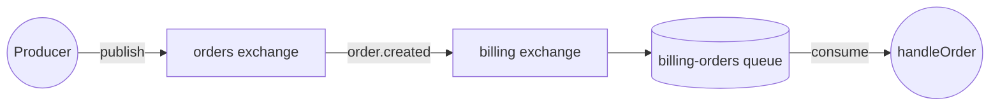

# Bridge domains

A **bridge exchange** routes messages across domain boundaries through a local exchange that forwards to — or receives from — a remote one. Each domain's contract stays self-contained: your service references _its own_ exchanges, and amqp-contract generates the exchange-to-exchange bindings that connect them.

## Decide whether you need one

Reach for a bridge when you want to:

- subscribe to another domain's events without coupling your contract to its exchange topology;
- publish a command into a remote domain's queue without your local code holding a direct reference to a remote exchange;
- have a single seam for cross-team auditing, security or routing rules.

If both sides live in the same codebase, do not bridge — share the exchange definition. A bridge adds a hop and an exchange to maintain.

## Consume events from another domain

The remote `orders` domain publishes `order.created` on its `orders` exchange. Your `billing` service wants those on its own queue.

```typescript
// Remote domain's exchange — referenced once, to declare the bridge
const ordersExchange = defineExchange("orders");

// Local exchange in the billing domain — the bridge
const billingExchange = defineExchange("billing");
const billingDlx = defineExchange("billing-dlx");
const billingQueue = defineQueue("billing-orders", {
  deadLetter: { exchange: billingDlx },
});

const orderMessage = defineMessage(z.object({ orderId: z.string(), amount: z.number() }));
const orderCreated = defineEventPublisher(ordersExchange, orderMessage, {
  routingKey: "order.created",
});

export const contract = defineContract({
  consumers: {
    handleOrder: defineEventConsumer(orderCreated, billingQueue, {
      bridgeExchange: billingExchange,
    }),
  },
});
```



`defineContract` extracts both exchanges, the queue-to-exchange binding (`billing-orders` ← `billing`) and the exchange-to-exchange binding (`billing` ← `orders`, on `order.created`). The handler is identical to the non-bridged version.

## Publish commands into another domain

The reverse. The remote `inventory` domain owns a queue you want to send commands to.

```typescript
// Remote domain
const inventoryExchange = defineExchange("inventory");
const inventoryDlx = defineExchange("inventory-dlx");
const inventoryQueue = defineQueue("inventory-commands", {
  deadLetter: { exchange: inventoryDlx },
});

// Local bridge
const localExchange = defineExchange("ordering-out");

const reserveMessage = defineMessage(z.object({ sku: z.string(), quantity: z.number() }));
const reserveCommand = defineCommandConsumer(inventoryQueue, inventoryExchange, reserveMessage, {
  routingKey: "inventory.reserve",
});

export const contract = defineContract({
  publishers: {
    reserveStock: defineCommandPublisher(reserveCommand, {
      bridgeExchange: localExchange,
    }),
  },
});
```

The publisher targets `ordering-out`; the generated binding forwards to `inventory`. Your code calls `client.publish("reserveStock", { … })` and never names the remote exchange.

## Keep exchange types compatible

Bridge and source/destination exchanges must have compatible types:

- `fanout` ↔ `fanout`
- `topic` / `direct` ↔ `topic` / `direct`
- `headers` ↔ `headers`

Mismatches are a type error at `defineEventConsumer` / `defineCommandPublisher`, not a runtime surprise.

## See bridges in the AsyncAPI document

The [generator](/how-to/generate-asyncapi) surfaces bridge bindings on both exchanges' channels. The description carries a readable summary (`forwards to 'billing'`, `receives from 'orders'`), and a structured extension carries the detail:

```yaml
x-amqp-exchange-bindings:
  forwardsTo:
    - destination: billing
      routingKey: order.created
```

Cross-domain routing therefore has one source of truth, inside the contract.

## Know when to avoid one

- **Same codebase** — share the exchange definition instead.
- **One-off forwarding** — with only ever one consumer in a domain, point the queue at the source exchange directly.
- **Performance-critical fan-out** — each bridge adds a publish step. Native bindings from source exchange to target queues are cheaper.

## Where next

- [Define a contract](/how-to/define-a-contract) — event and command fundamentals.
- [Generate AsyncAPI](/how-to/generate-asyncapi) — how bridges are documented.
